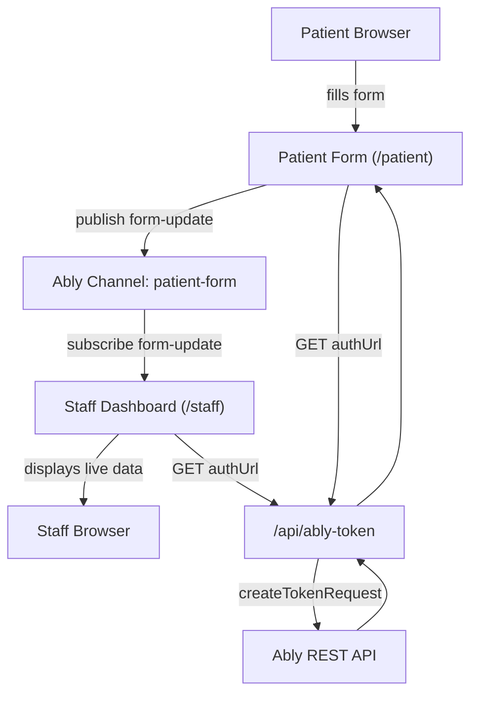
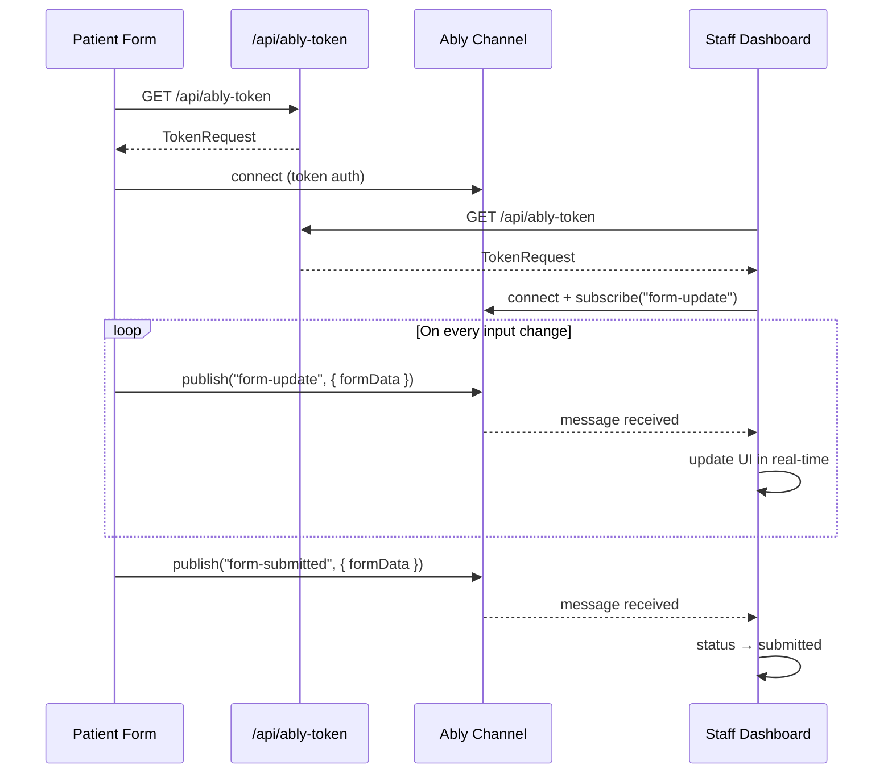
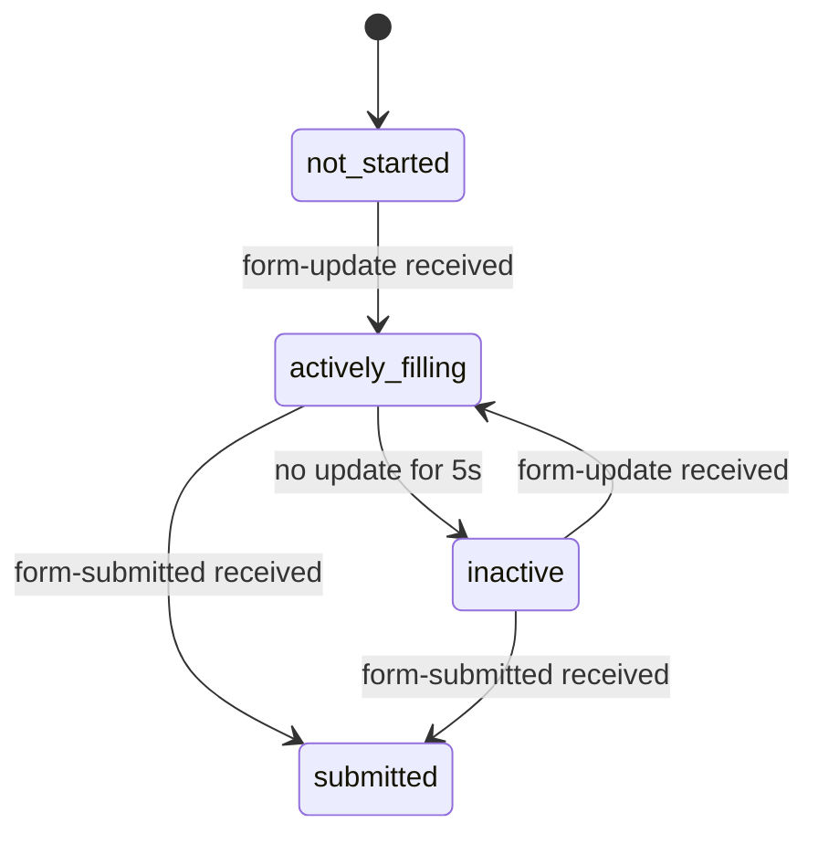

# Agnos Frontend Assignment

Real-time patient intake system built with Next.js 15, Ably Pub/Sub, and TailwindCSS.

## Architecture



## Real-time Flow



## Status Lifecycle



## Tech Stack

| Layer | Technology |
|---|---|
| Framework | Next.js 15 (App Router) |
| Styling | TailwindCSS |
| Real-time | Ably Pub/Sub |
| Forms | React Hook Form + Zod |
| Icons | lucide-react |

## Getting Started

### 1. Install dependencies

```bash
npm install
```

### 2. Configure environment

```bash
cp .env.local.example .env.local
```

Add your Ably API key to `.env.local`:

```env
ABLY_API_KEY=your_ably_api_key_here
```

Get a free key at [ably.com](https://ably.com/signup).

### 3. Run development server

```bash
npm run dev
```

### 4. Open in browser

| URL | Description |
|---|---|
| http://localhost:3000 | Home |
| http://localhost:3000/patient | Patient registration form |
| http://localhost:3000/staff | Staff dashboard |

> Open `/patient` and `/staff` in **separate tabs** for real-time sync to work.

## Project Structure

```
src/
├── app/
│   ├── api/ably-token/route.ts   # Token auth endpoint (server-side)
│   ├── patient/page.tsx          # Patient form
│   ├── staff/page.tsx            # Staff dashboard
│   └── page.tsx                  # Home page
├── components/ui/                # Shared UI components
├── lib/
│   └── ably.ts                   # Ably singleton client
└── types/
    └── patient.ts                # Zod schemas and types
```

## Design Decisions

### Responsive Design
- **Mobile-first approach** using TailwindCSS breakpoints (`sm:`, `md:`, `lg:`)
- Single-column layout on mobile, multi-column grid on desktop (`sm:grid-cols-2`, `md:grid-cols-2`)
- Patient form: full-width inputs on mobile, 2-column grid on tablet/desktop
- Staff dashboard: single-column cards on mobile, 2-column grid on desktop (`lg:grid-cols-2`)
- Touch-friendly input sizing with adequate padding (`px-4 py-2`)

### Healthcare Design System
- Clean white background (`bg-gray-50` page, `bg-white` cards) for clinical clarity
- Subtle borders (`border-gray-200`) over heavy shadows for professional look
- Blue accent (`blue-600`) as primary action color — calming and trustworthy
- No emoji in UI — replaced with `lucide-react` icons for accessibility and professionalism
- Status indicators use colored dots instead of emoji for screen reader compatibility

### Multi-Step Form
- 5-step wizard reduces cognitive load for patients filling out lengthy forms
- Step validation prevents progression with incomplete data
- Review step (step 5) allows patients to verify all data before submission
- Back navigation allows correction without losing previous step data

## Component Architecture

### Pages
| Page | Path | Description |
|------|------|-------------|
| Home | `app/page.tsx` | Landing page with links to patient form and staff dashboard |
| Patient Form | `app/patient/page.tsx` | 5-step registration form with real-time Ably publishing |
| Staff Dashboard | `app/staff/page.tsx` | Real-time monitoring dashboard subscribing to patient updates |
| Ably Token API | `app/api/ably-token/route.ts` | Server-side token generation — keeps API key secret |

### UI Components (`components/ui/`)
| Component | Description |
|-----------|-------------|
| `ProgressBar` | Step indicator showing current step and completed steps with check icons |
| `ConnectionStatus` | Green/red dot badge showing Ably WebSocket connection state |
| `StatusIndicator` | Colored dot + label showing patient form status (not started / actively filling / inactive / submitted) |
| `SectionCard` | Card container with icon and title for grouping related data fields |
| `DataField` | Label + value display with "Not provided" fallback for staff dashboard |

### Data Flow
```
Patient Form → (debounced 500ms) → Ably Channel → Staff Dashboard
     │                                                    │
     └─ publishes { sessionId, formData, timestamp }     └─ extracts message.data.formData
```

## Feature Branches

| Branch | Description |
|---|---|
| `feat/patient-form` | Multi-step patient registration form |
| `feat/staff-view` | Staff dashboard with real-time subscription |
| `feat/realtime-sync` | Ably token auth and sync bug fixes |
| `feat/redesign` | Healthcare UI redesign |
